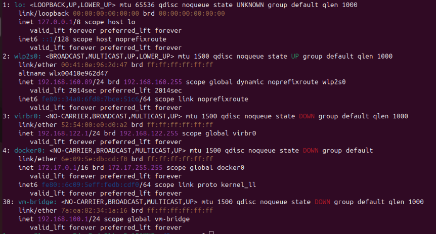

# Tarea8
Maquinas Virtuales 
Paso a paso para la creación e interconexión de tres máquinas virtuales (Rocky Linux, Kali Linux y Windows), y muestra cómo se logró que todas pudieran comunicarse entre sí.

---

## 1. Instalación de Rocky Linux

Para montar Rocky Linux se siguieron los siguientes pasos:

1. Descargué la ISO oficial desde el sitio de Rocky Linux.  
2. En VirtualBox se creó una nueva máquina: tipo Linux → Red Hat (64-bit).  
3. Se asignaron recursos: memoria (2–4 GB), disco virtual de ~20 GB.  
4. Se montó la ISO en la unidad óptica virtual y se inició la instalación.  
5. Durante la instalación se seleccionó idioma, zona horaria y se creó un usuario con privilegios.  
6. Al finalizar, se reinició la máquina y se configuró la red (modo *bridge*).  
7. Verificación: con `ip addr show` obtuve la dirección IP, con `ping -c 3 8.8.8.8` confirmé conectividad.

Evidencia fotografica 

---

## 2. Instalación de Kali Linux

Pasos para Kali:

1. Descarga de la ISO desde el sitio oficial de Kali.  
2. En VirtualBox, creación de máquina con tipo Linux → Debian (64-bit).  
3. Asignación de memoria (mínimo 2 GB) y disco (~30 GB).  
4. Se montó la ISO y se inició la instalación.  
5. Configuración de usuario y entorno gráfico (elegí XFCE).  
6. Al terminar, comprobé con `ip addr` y luego `ping -c 3 8.8.8.8` para validar que tenía salida de red.

---

## 3. Instalación de Windows (10/11)

Pasos:

1. Obtención de la ISO de Windows desde la web de Microsoft.  
2. Creación de la máquina virtual en VirtualBox: tipo Windows 10 (64-bit).  
3. Asignación de RAM (4–8 GB) y disco virtual (mínimo 40 GB).  
4. Montaje de la ISO y arranque de la instalación.  
5. Instalación normal: elección de partición, usuario, contraseña.  
6. Opcional: instalar las *Guest Additions* para facilitar integración entre host y VM.  
7. Comprobación de red desde Windows con `ipconfig`.

---

## 4. Conectividad entre las máquinas virtuales

Para permitir que Rocky, Kali y Windows se vean unas a otras:

1. En VirtualBox, configuré el adaptador de red de cada VM en modo **bridge (puente)**, de modo que todas estuvieran en la misma subred.  
2. Obtuve las IPs en cada VM:  
   - Rocky: `ip addr show`  
   - Kali: `ip addr`  
   - Windows: `ipconfig`  
3. Desde cada sistema hice ping hacia los otros (ej. desde Kali hice `ping <IP de Rocky>`, `ping <IP de Windows>`).  
4. Todas respondieron — con eso se confirmó la comunicación bidireccional entre las máquinas.

